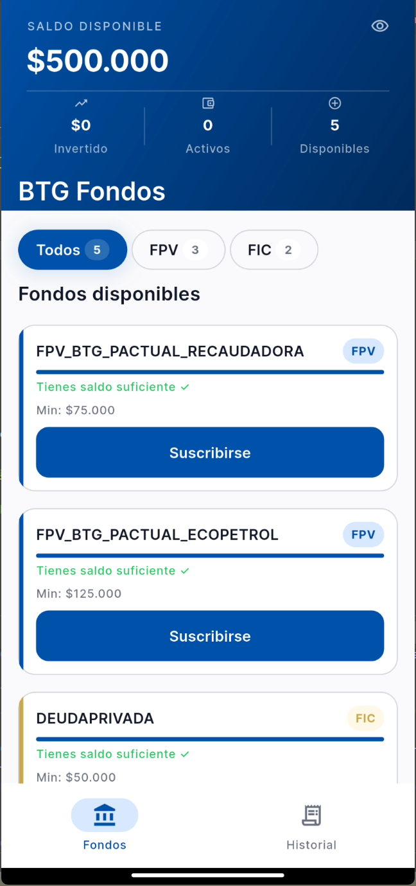
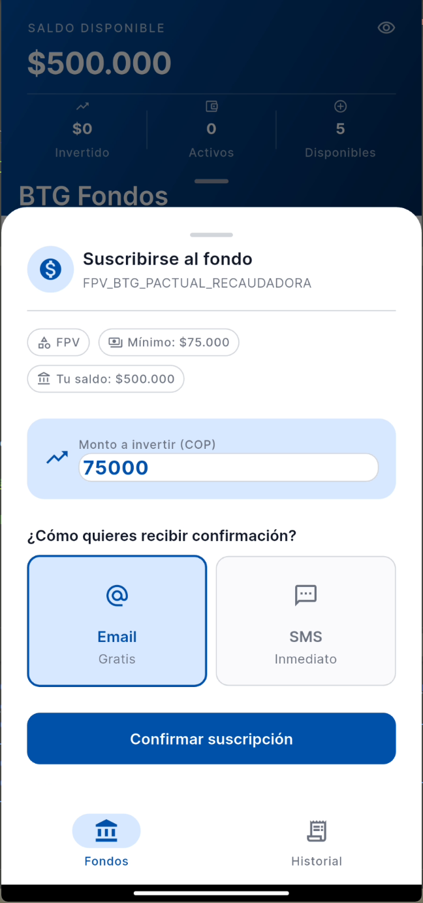
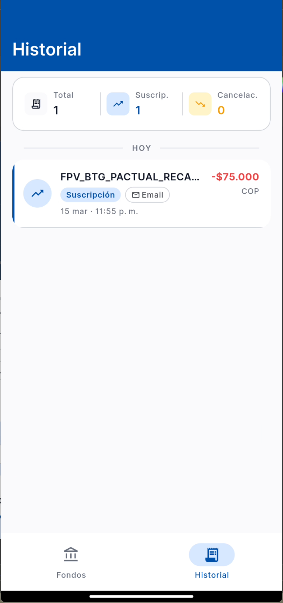
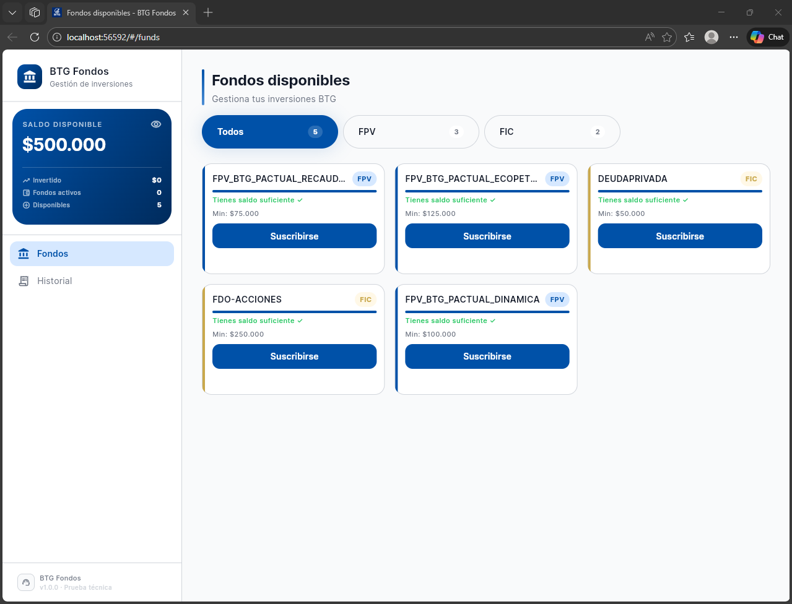
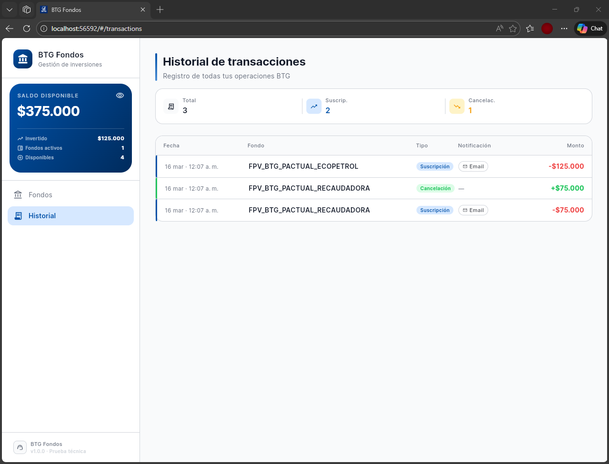

<p align="center">
  
  
  
  
  
</p>

<p align="center">
  <a href="https://btg-funds.web.app" target="_blank">
    
  </a>
  &nbsp;
  <a href="https://github.com/Hanuar99/btg-funds/releases/latest/download/btg-funds.apk" target="_blank">
    
  </a>
</p>

# Manejo de Fondos (FPV/FIC) para clientes BTG

Aplicación Flutter multiplataforma (Android · iOS · Web) para gestionar la suscripción y cancelación de fondos de inversión BTG, con historial de transacciones y notificaciones. Diseñada con **Clean Architecture** estricta y gestión de estado con **BLoC**.

---

## Tabla de Contenidos

- [Capturas y Demo](#capturas-y-demo)
- [Funcionalidades](#funcionalidades)
- [Arquitectura](#arquitectura)
- [Stack Tecnológico](#stack-tecnológico)
- [Estructura del Proyecto](#estructura-del-proyecto)
- [Datos del Negocio](#datos-del-negocio)
- [Requisitos Previos](#requisitos-previos)
- [Instalación y Ejecución](#instalación-y-ejecución)
- [Testing](#testing)
- [Design System](#design-system)
- [Decisiones Técnicas](#decisiones-técnicas)
- [CI/CD](#cicd--integración-y-despliegue-continuo)
- [Compatibilidad](#compatibilidad)
- [Licencia](#licencia)

---

## Capturas y Demo

### Links rápidos

| Plataforma | Link | Descripción |
|:---:|:---:|:---:|
| 🌐 **Web** | [btg-funds.web.app](https://btg-funds.web.app) | Desplegado en Firebase Hosting |
| 📱 **Android APK** | [Descargar última versión](https://github.com/Hanuar99/btg-funds/releases/latest/download/btg-funds.apk) | Build release desde GitHub Actions |

---

### Video — Flujo completo (móvil + web)

https://github.com/user-attachments/assets/1e21d630-eb48-4336-8433-8aae9572f00c

---

### Plataforma Móvil (Android / iOS)

| Lista de fondos | Suscripción | Historial |
|:---:|:---:|:---:|
|  |  |  |


---

### Plataforma Web (Chrome)

#### Vista principal — Lista de fondos



#### Vista historial de transacciones




---

## Funcionalidades

### Requisitos de la Prueba Técnica

| # | Funcionalidad | Estado |
|---|---------------|--------|
| 1 | Visualizar lista de fondos disponibles | ✅ Implementado |
| 2 | Suscribirse a un fondo con validación de monto mínimo | ✅ Implementado |
| 3 | Cancelar participación y ver saldo actualizado | ✅ Implementado |
| 4 | Historial de transacciones | ✅ Implementado |
| 5 | Selección de método de notificación (email / SMS) | ✅ Implementado |
| 6 | Error si saldo insuficiente | ✅ Implementado |

### Extras Implementados

| # | Funcionalidad | Detalle |
|---|---------------|---------|
| 7 | Persistencia entre sesiones | Hive — los datos sobreviven al cierre de la app |
| 8 | Diseño responsive | Layouts separados para móvil y web con breakpoints |
| 9 | Filtros por categoría | Filtro FPV / FIC en la lista de fondos |
| 10 | Animaciones | Transiciones, skeletons de carga, estados vacíos animados |
| 11 | Tests automatizados | 19 archivos · 225 casos de prueba |
| 12 | Design System con tokens | Colores, tipografía, espaciado y animaciones centralizados |

---

## Arquitectura

El proyecto sigue **Clean Architecture** estricta con separación en 4 capas:

```
┌─────────────────────────────────────────────────────────┐
│              PRESENTATION                               │
│   BLoC · Pages · Widgets · GoRouter                     │
└──────────────────────┬──────────────────────────────────┘
                       │ depende de
┌──────────────────────▼──────────────────────────────────┐
│                 DOMAIN                                  │
│   Entities · Use Cases · Repository Interfaces          │
│         (Solo Dart puro + Dartz + Equatable)            │
└────────────┬─────────────────────────┬──────────────────┘
  implementa │                         │ inversión de dependencia
┌────────────▼─────────────────────────▼──────────────────┐
│                  DATA                                   │
│   Models (Freezed) · Datasources · Repository Impl      │
└─────────────────────────────────────────────────────────┘
             ↑ todos usan ↑
┌─────────────────────────────────────────────────────────┐
│                  CORE                                   │
│   DI · Errors · Logger · Router · Storage · Theme       │
└─────────────────────────────────────────────────────────┘
```


---

## Stack Tecnológico

| Categoría | Tecnología | Versión | Propósito |
|-----------|------------|---------|-----------|
| **Estado** | `flutter_bloc` / `bloc` | latest | Gestión de estado reactiva con BLoC pattern |
| **Navegación** | `go_router` | latest | Navegación declarativa con soporte web URLs |
| **Code Gen** | `freezed` + `freezed_annotation` | latest | Generación de Events, States y Models inmutables |
| **Code Gen** | `json_serializable` + `json_annotation` | latest | Serialización JSON automática |
| **DI** | `get_it` + `injectable` | latest | Inyección de dependencias con generación automática |
| **Storage** | `hive_flutter` | latest | Almacenamiento local NoSQL — compatible con Web |
| **Errores** | `dartz` | latest | `Either<Failure, T>` para manejo funcional de errores |
| **Igualdad** | `equatable` | latest | Comparación por valor en entidades y failures |
| **Logging** | `logger` | latest | Logs estructurados y formateados en debug |
| **Red** | `connectivity_plus` / `internet_connection_checker_plus` | latest | Detección de conectividad |
| **Utils** | `uuid` | latest | Generación de IDs únicos para transacciones |
| **i18n** | `intl` | latest | Formateo de fechas y moneda en locale `es` |
| **Testing** | `mocktail` + `bloc_test` | latest | Mocks y tests especializados para BLoC |
| **Linter** | `very_good_analysis` | latest | Reglas de lint estrictas (Very Good Ventures) |
| **Build** | `build_runner` + `injectable_generator` | latest | Generación de código en tiempo de compilación |

---

## Estructura del Proyecto

```
lib/
├── main.dart                          ← Inicialización: Hive, DI, BLoC observer
├── app.dart                           ← MultiBlocProvider raíz + MaterialApp.router
├── core/
│   ├── di/
│   │   └── injection.dart             ← Registro GetIt con @InjectableInit
│   ├── errors/
│   │   ├── failures.dart              ← Jerarquía de Failures del dominio
│   │   ├── exceptions.dart            ← Excepciones de la capa data
│   │   └── error_handler.dart         ← Mapeo centralizado Exception → Failure
│   ├── logger/
│   │   └── app_logger.dart            ← Logger + AppBlocObserver
│   ├── network/
│   │   └── network_info.dart          ← Verificación de conectividad
│   ├── responsive/
│   │   └── responsive_system.dart     ← Breakpoints + DeviceType extension
│   ├── router/
│   │   ├── app_router.dart            ← GoRouter singleton con shell navigation
│   │   ├── app_routes.dart            ← Definición de rutas StatefulShellRoute
│   │   ├── route_names.dart           ← Constantes de rutas
│   │   ├── router_observer.dart       ← Logging de navegación
│   │   ├── router_transitions.dart    ← Transiciones de página personalizadas
│   │   └── shell/                     ← AppShell + TabSwitcher (NavigationBar/Rail)
│   ├── storage/
│   │   ├── storage_service.dart       ← Interfaz abstracta de almacenamiento
│   │   └── hive_storage_service.dart  ← Implementación con Hive
│   ├── theme/
│   │   ├── app_theme.dart             ← ThemeData completo Material 3
│   │   └── tokens/
│   │       ├── app_colors.dart        ← Paleta BTG (azul corporativo + gold)
│   │       ├── app_typography.dart    ← Escala tipográfica con Inter
│   │       ├── app_spacing.dart       ← Sistema de spacing 4px
│   │       ├── app_radius.dart        ← Border radius tokens
│   │       └── app_animations.dart    ← Duraciones y curvas de animación
│   ├── usecases/
│   │   └── usecase.dart               ← Clase base UseCase<T, Params>
│   ├── utils/
│   │   ├── currency_formatter.dart    ← Formateo de moneda COP
│   │   └── responsive_layout.dart     ← Utilidades responsive adicionales
│   └── widgets/                       ← Widgets reutilizables del design system
│       ├── animated_empty_state.dart
│       ├── app_button.dart
│       ├── app_card_surface.dart
│       ├── app_section_header.dart
│       ├── app_toast.dart
│       └── error_boundary.dart
└── features/
    ├── funds/
    │   ├── data/
    │   │   ├── datasources/
    │   │   │   └── funds_local_datasource.dart    ← Lee funds.json + operaciones CRUD
    │   │   ├── models/
    │   │   │   └── fund_model.dart                ← DTO Freezed con fromJson/toJson
    │   │   └── repositories/
    │   │       └── funds_repository_impl.dart      ← Implementa FundsRepository
    │   ├── domain/
    │   │   ├── entities/
    │   │   │   └── fund.dart                      ← Entidad Fund (Equatable)
    │   │   ├── repositories/
    │   │   │   └── funds_repository.dart           ← Interfaz abstracta
    │   │   └── usecases/
    │   │       ├── get_funds_usecase.dart          ← Obtener lista de fondos
    │   │       ├── subscribe_fund_usecase.dart     ← Suscribirse a un fondo
    │   │       └── cancel_fund_usecase.dart        ← Cancelar suscripción
    │   └── presentation/
    │       ├── bloc/
    │       │   ├── funds_bloc.dart                ← BLoC principal de fondos
    │       │   ├── funds_event.dart               ← Events (Freezed)
    │       │   └── funds_state.dart               ← States (Freezed)
    │       ├── dialogs/
    │       │   └── cancel_fund_dialog.dart         ← Diálogo de confirmación
    │       ├── helpers/
    │       │   └── funds_helpers.dart              ← Helpers de UI
    │       ├── pages/
    │       │   └── funds/
    │       │       ├── funds_page.dart             ← Página principal responsive
    │       │       ├── funds_mobile_layout.dart    ← Layout móvil (SliverAppBar)
    │       │       └── funds_web_layout.dart       ← Layout web (grid + sidebar)
    │       ├── sheets/
    │       │   └── subscribe_fund_sheet.dart       ← Bottom sheet de suscripción
    │       └── widgets/
    │           ├── animated_fund_item.dart         ← Animación de entrada
    │           ├── balance_header.dart             ← Widget de saldo
    │           ├── category_filter.dart            ← Filtro FPV/FIC
    │           ├── fund_card.dart                  ← Tarjeta de fondo
    │           ├── fund_card_skeleton.dart         ← Skeleton loading
    │           ├── fund_list.dart                  ← Lista/grid de fondos
    │           └── subscribe_bottom_sheet.dart     ← Sheet de suscripción
    ├── transactions/
    │   ├── data/
    │   │   ├── datasources/
    │   │   │   └── transactions_local_datasource.dart
    │   │   ├── models/
    │   │   │   └── transaction_model.dart          ← DTO Freezed
    │   │   └── repositories/
    │   │       └── transactions_repository_impl.dart
    │   ├── domain/
    │   │   ├── entities/
    │   │   │   └── transaction.dart                ← Entidad Transaction
    │   │   ├── repositories/
    │   │   │   └── transactions_repository.dart
    │   │   └── usecases/
    │   │       └── get_transactions_usecase.dart
    │   └── presentation/
    │       ├── bloc/
    │       │   ├── transactions_bloc.dart
    │       │   ├── transactions_event.dart
    │       │   └── transactions_state.dart
    │       ├── helpers/
    │       │   └── transactions_ui_helpers.dart
    │       ├── pages/
    │       │   └── transactions/
    │       │       ├── transactions_page.dart       ← Página responsive
    │       │       ├── transactions_mobile_layout.dart
    │       │       └── transactions_web_layout.dart
    │       ├── utils/
    │       │   └── transaction_date_formatter.dart
    │       └── widgets/
    │           ├── notification_method_chip.dart
    │           ├── transactions_date_separator.dart
    │           ├── transactions_loading_view.dart
    │           ├── transactions_summary_card.dart
    │           ├── transactions_web_table.dart
    │           ├── transaction_tile.dart
    │           └── transaction_type_badge.dart
    └── user/
        ├── data/
        │   ├── datasources/
        │   │   └── user_local_datasource.dart
        │   ├── models/
        │   │   └── user_model.dart                ← DTO Freezed
        │   └── repositories/
        │       └── user_repository_impl.dart
        ├── domain/
        │   ├── entities/
        │   │   └── user.dart                      ← Entidad User (saldo + fondos suscritos)
        │   └── repositories/
        │       └── user_repository.dart
        └── presentation/
            └── bloc/
                ├── user_bloc.dart
                ├── user_event.dart
                └── user_state.dart
```

---

## Datos del Negocio

### Fondos BTG Disponibles

| ID | Nombre | Monto Mínimo (COP) | Categoría |
|----|--------|--------------------:|-----------|
| 1 | FPV_BTG_PACTUAL_RECAUDADORA | $75.000 | FPV |
| 2 | FPV_BTG_PACTUAL_ECOPETROL | $125.000 | FPV |
| 3 | DEUDAPRIVADA | $50.000 | FIC |
| 4 | FDO-ACCIONES | $250.000 | FIC |
| 5 | FPV_BTG_PACTUAL_DINAMICA | $100.000 | FPV |

### Reglas de Negocio

- **Saldo inicial:** COP $500.000
- **Suscripción:** se descuenta el monto mínimo del fondo del saldo del usuario
- **Cancelación:** se devuelve el monto invertido al saldo del usuario
- **Saldo insuficiente:** error si el balance es menor al monto mínimo del fondo
- **Doble suscripción:** no se permite suscribirse dos veces al mismo fondo
- **Cancelación inválida:** error si se intenta cancelar un fondo no suscrito
- **Notificación:** al suscribirse se selecciona método (email o SMS)
- **Persistencia:** estado almacenado en Hive, sobrevive al cierre de la app

---

## Requisitos Previos

| Herramienta | Versión mínima |
|-------------|----------------|
| Flutter SDK | Canal stable (Dart SDK ≥ 3.11.1) |
| Dart SDK | ≥ 3.11.1 |
| Editor | VS Code (recomendado) o Android Studio |
| Chrome | Última versión (para ejecución web) |

Verifica tu entorno:

```bash
flutter doctor
```

---

## Instalación y Ejecución

```bash
# 1. Clonar el repositorio
git clone https://github.com/Hanuar99/btg-funds.git
cd btg-funds

# 2. Instalar dependencias
flutter pub get

# 3. Generar código (Freezed + Injectable + json_serializable)
dart run build_runner build --delete-conflicting-outputs

# 4. Ejecutar en Web (recomendado para la prueba técnica)
flutter run -d chrome

# 5. Ejecutar en móvil (Android/iOS)
flutter run

# 6. Analizar código
flutter analyze

# 7. Formatear código
dart format .
```

> **Nota:** El paso 3 es obligatorio antes de la primera ejecución. Genera los archivos `*.g.dart`, `*.freezed.dart` y `*.config.dart`.

---

## Testing

### Comandos

```bash
# Correr todos los tests
flutter test

# Solo tests de features (domain, data, presentation)
flutter test test/features/

# Solo tests de core (errors, usecases)
flutter test test/core/

# Con reporte de cobertura
flutter test --coverage
```

### Cobertura por Capa

| Capa | Archivos de test | Casos de prueba |
|------|:----------------:|:---------------:|
| **Core — Errors / Use Cases** | 2 | 24 |
| **Domain — Entities** | 3 | 45 |
| **Domain — Use Cases** | 5 | 60 |
| **Data — Models** | 3 | 53 |
| **Data — Repositories** | 3 | 40 |
| **Presentation — BLoCs** | 3 | 3 |
| **Total** | **19** | **225** |

---

## Design System

### Tokens Centralizados

El proyecto usa un **design system basado en tokens** — nunca se hardcodean colores, tamaños ni duraciones directamente en widgets.

**AppColors** — Paleta BTG Pactual:
- Primario: azul corporativo BTG (`#0051A8`) con escala 100–900
- Acento: dorado BTG (`#C9A84C`)
- Semánticos: success (verde), error (rojo), warning (ámbar)
- Categorías: FPV (azul), FIC (dorado)

**AppTypography** — Fuente Inter:
- Escala: `displayLarge` (32px) → `labelSmall` (11px)
- Pesos: Regular (400), Medium (500), SemiBold (600), Bold (700)

**AppSpacing** — Sistema 4px:
- `xs: 4` · `sm: 8` · `md: 16` · `lg: 24` · `xl: 32` · `xxl: 48`

**AppAnimations** — Duraciones y curvas:
- `fast: 150ms` · `normal: 300ms` · `slow: 500ms`
- Curvas: `easeInOut`, `easeOut`, `elasticOut`

### Ejemplo de Uso

```dart
// Colores — nunca hardcodear
Container(color: AppColors.primary)

// Tipografía — siempre tokens
Text('Título', style: AppTypography.headlineMedium)

// Espaciado — siempre tokens
Padding(padding: EdgeInsets.all(AppSpacing.md))

// Animaciones — siempre tokens
AnimatedContainer(duration: AppAnimations.normal, curve: AppAnimations.defaultCurve)
```

---

## Decisiones Técnicas

| Decisión | Elección | Justificación |
|----------|----------|---------------|
| **Almacenamiento** | Hive | Compatible con Flutter Web sin FFI; NoSQL ligero y rápido |
| **Manejo de errores** | Dartz `Either<Failure, T>` | Manejo funcional — los errores son valores, no excepciones |
| **Fuente de datos** | Assets JSON local | Portátil, sin dependencias externas (Node.js, servidor) |
| **Gestión de estado** | BLoC | Separación clara evento/estado, altamente testeable |
| **Navegación** | GoRouter | Declarativo, soporte nativo de URLs web, shell navigation |
| **Code generation** | Freezed + Injectable | Elimina boilerplate, garantiza inmutabilidad |
| **Responsive** | Breakpoints + layouts duales | Mobile/Web layouts separados, no solo media queries |
| **Linter** | very_good_analysis | Reglas estrictas de calidad (Very Good Ventures) |
| **Testing** | mocktail + bloc_test | Mocks sin código generado, tests de BLoC declarativos |
| **Arquitectura** | Clean Architecture 3 capas | Domain aislado, Data reemplazable, Presentation desacoplada |
| **DI** | GetIt + Injectable | Service locator con registro automático por anotaciones |
| **Tipografía** | Inter (custom font) | Legibilidad, aspecto profesional, pesos múltiples |

---

## CI/CD — Integración y Despliegue Continuo

El proyecto tiene **3 pipelines** de GitHub Actions completamente configurados:

```
push a main
        │
        ▼
┌───────────────────────────────────────────┐
│  CI — Calidad de código                   │
│  analyze · format · test · codecov        │
└──────────────────────┬────────────────────┘
                       │ ✅ si pasa
          ┌────────────┴────────────┐
          ▼                         ▼
┌──────────────────────┐  ┌──────────────────────┐
│  CD — Firebase Web   │  │  CD — APK Release    │
│  build web --release │  │  build apk --release │
│  → btg-funds.web.app │  │  → GitHub Releases   │
└──────────────────────┘  └──────────────────────┘
```

### Descripción de cada pipeline

| Workflow | Disparador | Pasos | Resultado |
|----------|-----------|-------|-----------|
| **CI — Calidad** | Todo push | Analyze · Format · Test · Codecov | Badge de estado en cada commit |
| **CD — Web (Producción)** | Push a `main` | Calidad → Build web → Deploy | [btg-funds.web.app](https://btg-funds.web.app) actualizado |
| **CD — APK Release** | Push a `main` | Build APK release | Descargable en [GitHub Releases](https://github.com/Hanuar99/btg-funds/releases/latest) |

### Badges de estado

<p align="center">
  <a href="https://github.com/Hanuar99/btg-funds/actions/workflows/ci.yml">
    
  </a>
  <a href="https://github.com/Hanuar99/btg-funds/actions/workflows/firebase-hosting-merge.yml">
    
  </a>
  <a href="https://github.com/Hanuar99/btg-funds/actions/workflows/release-apk.yml">
    
  </a>
</p>

---

## Compatibilidad

| Plataforma | Estado | Notas |
|------------|--------|-------|
| Android | ✅ Soportado | Material 3, NavigationBar |
| iOS | ✅ Soportado | Material 3, compatible con SafeArea |
| Web (Chrome) | ✅ Soportado | URL routing con GoRouter, layout web con grid |
| Web (Firefox) | ✅ Soportado | Sin dependencias específicas de Chrome |
| Web (Safari) | ✅ Soportado | Hive Web compatible |


---


